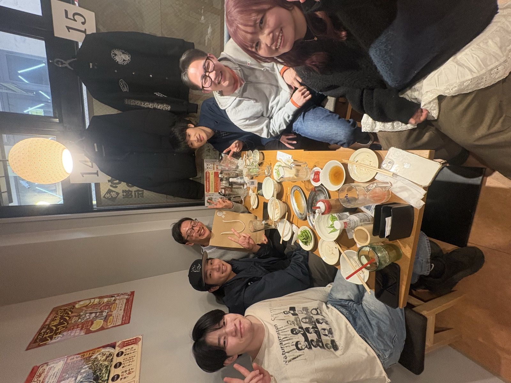

<!-- - [2025年4月の活動報告](/activities/2025/202504) -->

以下は2025年の10月27日(月)に書いています．
- 4月1日付けで[香川大学](https://www.kagawa-u.ac.jp/) [創造工学部](https://www.kagawa-u.ac.jp/kagawa-u_ead/)[建築・都市環境コース](https://www.kagawa-u.ac.jp/kagawa-u_ead/course/architecture/)に准教授として着任しました．
- 研究室に4年生の吾郷さんと阿部さんが配属となりました．思い返せば16年前，秋田高専で最初の配属学生も2名でした．

以下は2026/10/02にまとめて書きました．
- 2025/4/23 研究室キックオフ飲み会を開催しました．
- 2025/5/28 ヒト・モビリティ・ソサエティに関わるシミュレーション技術の高度化コンソーシアムWGに参加し，瀬戸内シミュレータ株式会社様の開発したMR歩行者シミュレータを体験しました．
- 2025/6/7-2025/6/8 第71回土木計画学研究発表会・春大会が香川大学幸町キャンパスにて開催されました．運営のお手伝いの合間に，何名かの旧知の先生方に着任のご挨拶もできました．
- 2025/8/6-2025/8/8 交通工学研究発表会に参加し，秋田高専時代の指導学生（小松さん）の卒業研究を元にした「生活道路における車両速度と歩車間距離が不安感に与える影響」を発表しました．
- 2025/9/26 卒業研究中間発表会が開催され，吾郷さんと阿部さんが発表しました．
- 2025/9/29 徳島大学社会産業理工学研究交流会2025に参加し，秋田高専時代の指導学生（菅原さん・小貫さん）の卒業研究を元にした「生成AI・拡張現実を活用した幼児・児童向け交通安全教室の試行」を発表しました．
- 香川大学イノベーションデザイン研究所 令和7年度HMSコンソーシアム参画研究者経費支援より「現地観測と分散シミュレーションによる無信号横断歩道における歩行者・ドライバーの非言語的コミュニケーションに関する研究」について，経費支援をいただけることになりました．
- 2025/10/22 研究室に学部3年生の小川さん・佐伯さん・安葉さん・山崎さんが配属されました．
- 2025/10/25 屋島レクザムフィールドで開催された「あいおいニッセイ同和損保SAFETOWNDRIVE」にて香川県警の方とともに「第1部：交通安全教室」の講師として講話しました．デフサッカー日本代表キャプテンの松元選手が「第2部：音のない世界で伝わるもの」「第3部：デフサッカー体験会」の講師として参加されていて，現役アスリートの俊敏な動きに感動しました．
- 2025/11/12 新規配属の学部3年生歓迎のため，研究室キックオフ飲み会（本年度2回目）を開催しました．
- 2025/12/12 玉置研・鈴木研と合同年末ゼミを開催し，吾郷さんと阿部さんが発表しました．ゼミの前には卒業アルバム用の集合写真を撮影し，ゼミ後には両研究室のOB・OGも参加して合同忘年会が開催されました．

- 2026/1/8 キャンベラ大学の中西先生，高知工科大学の杉浦先生とD1の佐瀬さん，香川大学からは長谷川と阿部さんが参加して，香川大学林町キャンパスにて合同ゼミを開催しました．ゼミ後は瓦町に会場を移し，美味しいワインと料理とともに懇親を深めました．
- 2026/1/16 8月に発表した論文をブラッシュアップして交通工学論文集（特集号）に投稿していた「[生活道路における歩行者の不安感と車両速度・歩車間距離の関係](https://www.jstage.jst.go.jp/article/jste/12/2/12_A_88/_article/-char/ja/)」が採択されました．
- 2026/1/30 HMSコンソーシアム＠愛知淑徳大学にて，同大学の森先生がお持ちの自転車シミュレータと小型モビリティシミュレータを体験しました．いずれも本格的な機材で，刺激を受けました．
- 2026/2/20 卒業論文発表会が開催され，吾郷さんと阿部さんが1年間の成果を発表しました．発表会後の会議にて2人とも無事に卒業研究の単位が認められました．
- 2026/2/24 研究室追い出しコンパを開催しました．といっても，学生6名中5名は来年度も引き続き研究室に残ります．あっという間の1年間でした．

